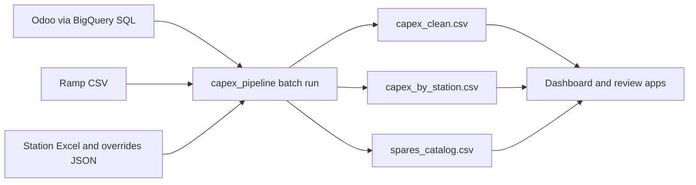

# Hardware Reliability Testing Budgeting App

Hardware Reliability CAPEX spend analytics platform for Base Power Company. Consolidates Purchase Order data from Odoo (via BigQuery), credit card transactions from Ramp, and station planning data into an interactive dashboard and review workflow.

## About

This section documents the current production behavior of the pipeline as implemented today.

### Current Workflow

1. **Extract Odoo PO data (batch pull)**  
   `capex_pipeline.py` runs `step1_pull_bigquery()` (or `step1_load_existing()` with `--skip-bq`) and saves `po_creators_last_7m.csv`.
2. **Load and normalize Ramp card transactions**  
   `step2_load_ramp()` calls `load_and_normalize_ramp()` to map Ramp categories into the unified CAPEX schema.
3. **Load station metadata**  
   `step3_load_stations()` loads station/cost-breakdown metadata from Excel (or cached JSON fallback).
4. **Clean and enrich Odoo data**  
   `step4_clean_odoo()` applies text/date/amount cleanup, category splitting, section-header merge, and part-number extraction.
5. **Unify Odoo + Ramp and map stations**  
   `step6_concatenate()` combines sources, then `step7_map_stations()` applies line typing, CAPEX tagging, and 3-tier auto-mapping.
6. **Apply human overrides and classify manufacturing subcategories**  
   `step8_apply_overrides()` applies `station_overrides.json`, then `step9_classify_subcategories()` enriches spend lines.
7. **Export analytics datasets**  
   `step10_export()` writes `capex_clean.csv`, `capex_by_station.csv`, and `spares_catalog.csv` for dashboard and review apps.



### Data Freshness (Real-Time vs Batch)

- **Pipeline execution is batch/manual**: runs are triggered from CLI (`python capex_pipeline.py`), not by a streaming/event job.
- **Historical query window**: Odoo extraction in `po_by_creators_last_7m.sql` is bounded to `DATE_SUB(CURRENT_DATE(), INTERVAL 7 MONTH)`.
- **Dashboard data refresh behavior**: apps reflect the newest exported CSVs after a pipeline run; source-system changes appear only on the next run.
- **Overrides behavior**: station/forecast/manual-entry overrides persist in files and are applied during subsequent export steps.

### Cleanup Rulesets (Current Implementation)

#### 1) SQL Extraction Rules (`bigquery/po_by_creators_last_7m.sql`)

- Creator scope is explicitly allowlisted in the `creators` CTE.
- Records are constrained to last 7 months using `po.date_order >= DATE_SUB(CURRENT_DATE(), INTERVAL 7 MONTH)`.
- Deleted accounting records are excluded with `IFNULL(am._fivetran_deleted, FALSE) = FALSE`.
- Bill-line duplicates are removed in `bill_links_dedup` via `ROW_NUMBER() ... WHERE rn = 1`.
- Bill payment status is normalized in `bill_status_by_line` (`paid`, `partial`, `unpaid`, `mixed`, `no_bill`).

#### 2) Core Normalization Rules (`bigquery/po_export_utils.py`)

- **Text cleanup**: `_to_single_line()` removes multi-line noise, `_strip_html()` removes tags/entities, `_extract_en_us_name()` normalizes Odoo JSON display names.
- **Numeric/date normalization**: `_format_currency()` rounds money fields, `_format_qty()` normalizes quantities, `_format_ts()` standardizes timestamps.
- **Category + line structuring**: `split_product_category()` separates category from description; `merge_section_headers()` backfills missing item descriptions from section rows.
- **Line semantics**: `classify_line_type()` tags `spend` / `payment_terms` / `section_header` / `misc`; `tag_capex_flag()` sets CAPEX membership.
- **Ramp harmonization**: `load_and_normalize_ramp()` filters to mapped accounting categories, generates stable IDs, normalizes dates/user aliases, and reshapes to Odoo-compatible schema.
- **Station assignment rules**: `auto_map_stations()` applies direct CIP mapping, scored matching (vendor/project/keywords), and non-prod/pilot routing with confidence tiers.
- **Human precedence**: `apply_overrides()` applies `station_overrides.json` and sets final `mapping_status` (`confirmed`, `skipped`, `non_prod`, `pilot_npi`, `auto`, `unmapped`).

#### 3) Export Integrity Rules (`bigquery/capex_pipeline.py`)

- Final spend export includes only confirmed PO states (`purchase`, `sent`) plus all Ramp rows.
- Existing manual rows are preserved from prior `capex_clean.csv` exports.
- Duplicate line records are deduplicated by `line_id` with last-write-wins behavior.
- Forecast overrides are normalized by uppercased station IDs and applied to `capex_by_station.csv`.
- Variance fields are computed as `actual_spend - forecasted_cost` and `% variance` with divide-by-zero protection.

#### 4) Manual Review Validation Rules (`bigquery/station_review_app.py`)

- Manual entry payloads require `po_number`, `date_order`, `vendor_name`, `item_description`, `price_subtotal`.
- `date_order` must parse as a valid date and `price_subtotal` must parse as numeric.
- `project_name` and `mfg_subcategory` are validated against supported option sets when provided.
- Manual rows use stable deterministic IDs (`MANUAL-...`) and are upserted only against manual-source rows.

## Architecture

```
bigquery/
│
│  # ── Apps ──────────────────────────────────────────────────
├── capex_dashboard.py        # Flask dashboard (Plotly charts, DataTables)
├── station_review_app.py     # Flask review UI for station mapping corrections
├── capex_v2_pages.py         # V2 API routes (classification, payments, cashflow, RFQ)
│
│  # ── Pipeline ──────────────────────────────────────────────
├── capex_pipeline.py         # End-to-end data pipeline (single entry point)
├── po_export_utils.py        # Shared cleaning, mapping, extraction logic
├── mfg_subcategory.py        # Manufacturing subcategory classification rules
│
│  # ── AI / LLM ──────────────────────────────────────────────
├── classify_agent.py         # LLM classification review agent (weekly / on-demand)
├── llm_adapter.py            # Provider-agnostic LLM interface (Gemini, OpenAI, etc.)
├── rfq_ai_service.py         # AI RFQ generation from vendor quotes
├── rfq_odoo_validation.py    # RFQ lookup + validation for Odoo import
├── prompts/
│   ├── classification_system.txt
│   ├── classification_examples.json
│   ├── rfq_system.txt
│   └── rfq_examples.json
│
│  # ── Data / Analytics ──────────────────────────────────────
├── bq_dataset.py             # BigQuery dataset + table management (capex_analytics)
├── cashflow.py               # Cashflow projection helpers
├── payment_patterns.py       # Payment pattern analysis
├── sheets_forecast_import.py # Google Sheets forecast import
│
│  # ── Infrastructure ────────────────────────────────────────
├── storage_backend.py        # Storage abstraction: local FS / GCS / BigQuery
├── auth.py                   # Google OAuth 2.0 (basepowercompany.com only)
├── user_google_auth.py       # Signed-in user OAuth credential helpers
├── access_control.py         # Role-based access (owner / editor / viewer)
├── odoo_client.py            # Odoo XML-RPC client
├── push_clean_to_cloud.py    # Push local data to GCS
├── refresh_job_runner.py     # Cloud Run Job entry point for scheduled refresh
│
│  # ── SQL Queries ───────────────────────────────────────────
├── po_by_creators_last_7m.sql
├── po_by_number.sql
├── po_by_krupal_patel.sql
├── payment_details.sql
├── ramp_from_odoo.sql
│
│  # ── CLI Query Runners ─────────────────────────────────────
├── run_po_creators_7m.py     # BigQuery runner: all PO creators (last 7 months)
├── run_po_by_number.py       # BigQuery runner: single PO lookup
├── run_po_krupal_query.py    # BigQuery runner: POs by Krupal Patel
├── run_odoo_query.py         # BigQuery runner: generic Odoo account query
│
│  # ── Deploy / Config ───────────────────────────────────────
├── Dockerfile                # Unified image for both apps (APP_MODE env var)
├── deploy.ps1 / deploy.sh    # Cloud Run deployment scripts
├── setup_scheduler_alerts.ps1 # Cloud Scheduler + Monitoring alert setup
├── requirements.txt          # Python dependencies
│
└── data/                     # Local pipeline output (gitignored)
    ├── capex_clean.csv
    ├── capex_by_station.csv
    ├── spares_catalog.csv
    ├── bf1_stations.json
    ├── station_overrides.json
    └── dashboard_settings.json
```

## Features

- **Executive Summary** -- KPIs, budget vs actual by module, monthly spend trends, spend by employee
- **Odoo vs Ramp** -- Side-by-side comparison of PO and credit card spend
- **Station Drill-Down** -- Per-station BOM, vendor breakdown, order timeline, editable forecasts
- **Vendor Analysis** -- Top vendors, station heatmap, concentration metrics
- **Materials / Spares** -- Searchable catalog with part numbers extracted from descriptions
- **Unit Economics** -- $/GWh and ft²/GWh per production line (hub-capacity method)
- **Other Projects** -- Non-production spend (NPI, Pilot, Facilities, Quality, IT, etc.)
- **Global Line Filter** -- Filter all pages by production line (MOD/INV)
- **Chart Drill-Down** -- Click any chart element to see underlying transactions
- **Station Review UI** -- Agent-assisted mapping with human override workflow
- **Table View** -- Full DataTable with inline editing, column filters, CSV export

## Prerequisites

- Python 3.12+
- Google Cloud SDK (`gcloud`) authenticated with BigQuery access
- GCP project `mfg-eng-19197` (for cloud deployment)

## Local Development

```bash
cd bigquery
python -m venv venv
# Windows
venv\Scripts\activate
# Linux/macOS
source venv/bin/activate

pip install -r requirements.txt
```

### Run the pipeline

```bash
# Full run (pulls fresh data from BigQuery)
python capex_pipeline.py

# Skip BigQuery pull (reprocess local data only)
python capex_pipeline.py --skip-bq
```

### Start the apps

```bash
# Dashboard on :5050
python capex_dashboard.py

# Review UI on :5051
python station_review_app.py
```

## Cloud Deployment (Google Cloud Run)

Both apps share a single Docker image. The `APP_MODE` environment variable selects which app runs.
Deploy scripts now support:
- private Cloud Run services (`--no-allow-unauthenticated`)
- explicit runtime service account
- Secret Manager-backed OAuth/session secrets
- optional Cloud Run Job deployment for daily incremental refresh

### Environment variables (set on Cloud Run)

| Variable | Purpose |
|---|---|
| `APP_MODE` | `dashboard` or `review` |
| `GCS_BUCKET` | GCS bucket name for data files |
| `BQ_ANALYTICS_PROJECT` | BigQuery project for analytics writes/reads |
| `BQ_ANALYTICS_DATASET` | BigQuery analytics dataset (for example `capex_analytics`) |
| `BQ_QUERY_PROJECT` | BigQuery project used for query job execution/billing |
| `ODOO_SOURCE_PROJECT` | BigQuery project hosting Odoo source tables |
| `ODOO_SOURCE_DATASET` | BigQuery dataset hosting Odoo source tables |
| `REFRESH_EXECUTION_MODE` | `job` (recommended in cloud) or `subprocess` (local/default fallback) |
| `REFRESH_JOB_NAME` | Cloud Run Job name used for on-demand refresh (default `capex-refresh-job`) |
| `REFRESH_JOB_PROJECT` | Project that owns the refresh job |
| `REFRESH_JOB_REGION` | Region that hosts the refresh job |
| `REFRESH_TIMEOUT_SEC` | Timeout for refresh execution (`subprocess` mode and job runner) |
| `REFRESH_USE_LOGGED_IN_OAUTH` | When `true`, on-demand refresh injects signed-in user OAuth token for Odoo/source pulls |
| `USE_SIGNED_IN_USER_GCP` | When `false` (recommended), Gemini/LLM and non-refresh GCP calls use service account creds |
| `PREFER_BIGQUERY_MAPPED_CSV` | When `true`, reads for `capex_clean.csv`/`capex_by_station.csv`/`spares_catalog.csv` are served from BigQuery first |
| `ALLOW_MAPPED_CSV_FALLBACK` | Allow fallback to CSV/GCS for mapped datasets if BigQuery read fails (`false` recommended in cloud) |
| `WRITE_MAPPED_CSV_TO_BIGQUERY` | When `true`, writes to mapped CSV aliases are mirrored to BigQuery tables |
| `WRITE_MAPPED_CSV_TO_BIGQUERY_STRICT` | When `true`, mapped CSV writes fail if BigQuery mirror write fails |
| `GOOGLE_CLIENT_ID` | OAuth 2.0 client ID (set via Secret Manager preferred) |
| `GOOGLE_CLIENT_SECRET` | OAuth 2.0 client secret (set via Secret Manager preferred) |
| `FLASK_SECRET_KEY` | Flask session signing key (set via Secret Manager preferred) |
| `AUTH_DEBUG` | Optional, set `true` only for OAuth debugging (`/auth/debug`) |

### Deploy script configuration

The deploy scripts accept configuration through environment variables:

| Variable | Default |
|---|---|
| `PROJECT` | `mfg-eng-19197` |
| `REGION` | `us-central1` |
| `GCS_BUCKET` | `capex-pipeline-data` |
| `BQ_QUERY_PROJECT` | `<PROJECT>` |
| `SERVICE_ACCOUNT` | `capex-dashboard-sa@<PROJECT>.iam.gserviceaccount.com` |
| `REFRESH_JOB_NAME` | `capex-refresh-job` |
| `REFRESH_EXECUTION_MODE` | auto: `job` when job is deployed, else `subprocess` |
| `REFRESH_USE_LOGGED_IN_OAUTH` | `true` |
| `USE_SIGNED_IN_USER_GCP` | `false` |
| `PREFER_BIGQUERY_MAPPED_CSV` | `true` |
| `ALLOW_MAPPED_CSV_FALLBACK` | `false` |
| `WRITE_MAPPED_CSV_TO_BIGQUERY` | `true` |
| `WRITE_MAPPED_CSV_TO_BIGQUERY_STRICT` | `true` |
| `USE_SECRET_MANAGER` | `true` |
| `GOOGLE_CLIENT_ID_SECRET` | `capex-google-client-id` |
| `GOOGLE_CLIENT_SECRET_SECRET` | `capex-google-client-secret` |
| `FLASK_SECRET_KEY_SECRET` | `capex-flask-secret-key` |

### Deploy

```powershell
# PowerShell (builds image, deploys services, deploys refresh job, optionally seeds data)
cd bigquery
.\deploy.ps1 -Seed
```

```bash
# Bash (same behavior as PowerShell script)
cd bigquery
bash deploy.sh --seed
```

Useful flags:
- `--v2` / `-V2`: also deploy `capex-dashboard-v2`
- `--no-job` / `-NoJob`: skip Cloud Run Job deployment
- `--no-secrets` / `-NoSecrets`: inject auth via plain env vars (not recommended)

### Daily refresh scheduling

The deploy scripts can create the Cloud Run Job (`capex-refresh-job`).  
Run ad-hoc refresh:

```bash
gcloud run jobs execute capex-refresh-job --project=<PROJECT> --region=<REGION> --wait
```

Recommended schedule (once per day) using Cloud Scheduler:

```bash
gcloud scheduler jobs create http capex-refresh-daily \
  --project=<PROJECT> \
  --location=<REGION> \
  --schedule="0 8 * * *" \
  --uri="https://<REGION>-run.googleapis.com/apis/run.googleapis.com/v1/namespaces/<PROJECT>/jobs/capex-refresh-job:run" \
  --http-method=POST \
  --oauth-service-account-email=<SCHEDULER_SA_EMAIL> \
  --oauth-token-scope="https://www.googleapis.com/auth/cloud-platform"
```

Grant the scheduler service account permission to invoke the job:

```bash
gcloud projects add-iam-policy-binding <PROJECT> \
  --member="serviceAccount:<SCHEDULER_SA_EMAIL>" \
  --role="roles/run.invoker"
```

### Gmail alerting setup (failure + staleness)

Use the helper script to configure scheduler + Monitoring alert policies with email notifications:

```powershell
cd bigquery
.\setup_scheduler_alerts.ps1 `
  -Project "mfg-eng-19197" `
  -Region "us-central1" `
  -AlertEmails @("you@basepowercompany.com")
```

Notes:
- If `data/dashboard_settings.json` has `ops_refresh_cron`, `ops_refresh_timezone`, and `ops_alert_emails`, the script uses those defaults automatically.
- Alert policies created:
  - `CAPEX Refresh Job Failure` (triggered by `refresh_job_failed` event logs)
  - `CAPEX Refresh Stale (No Success > 26h)` (absence of success events)
- You may need `gcloud alpha`/`gcloud beta` components installed for Monitoring channel/policy commands.

### Staging and cutover (v2)

Recommended promotion flow for `capex-dashboard-v2`:
- Deploy v2 with job-backed refresh enabled (`REFRESH_EXECUTION_MODE=job`) and verify `/api/v2/refresh-status` reports the expected `execution_mode` and `job_name`.
- Run one on-demand refresh from Settings and confirm status transitions `running -> ok` with no lock/cooldown errors.
- Compare v2 vs current production on key pages: Executive Summary totals, Payment Milestones, Cashflow, and drill-down row counts for at least 3 representative stations/POs.
- Validate access control: owner can manage editor emails, editors can run refresh/upload/actions, viewers are blocked from settings mutations.
- Keep rollback simple: leave current production service deployed, and only update links/traffic after parity checks pass.

## Data Flow

1. **BigQuery** -- Pull Odoo PO data for specified creators (last 7 months)
2. **Ramp CSV** -- Merge credit card transactions into unified schema
3. **Station Mapping Agent** -- Auto-classify transactions to BF1 production stations
4. **Human Review** -- Override/correct mappings via the review UI
5. **Pipeline Output** -- `capex_clean.csv`, `capex_by_station.csv`, `spares_catalog.csv`
6. **Dashboard** -- Interactive visualization of all processed data

## Authentication

Cloud deployment uses in-app Google OAuth 2.0, restricted to `@basepowercompany.com` accounts. Local development skips auth when `GOOGLE_CLIENT_ID` is not set.
